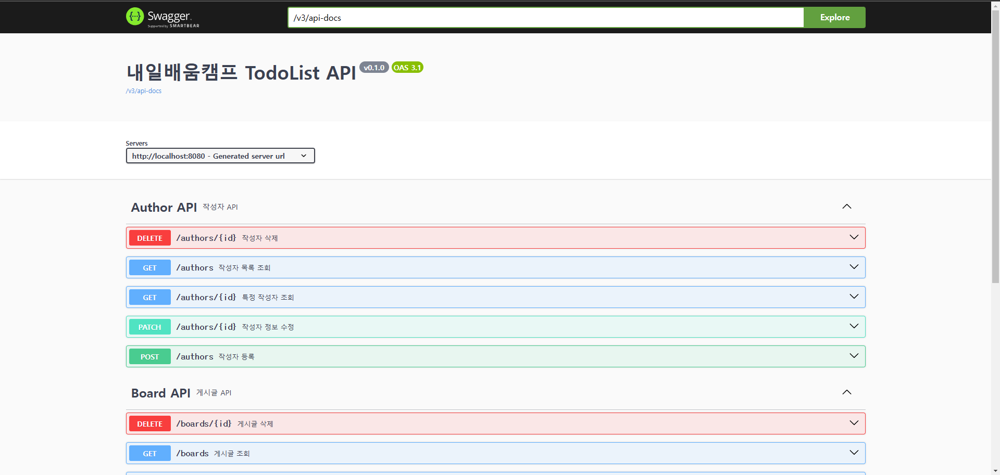

# 내일배움캠프 TodoList 과제

- Spring 과 Jdbc를 이용한 요구사항 완료하기

***
## API 명세서

[Swagger 링크](https://wjswlgh96.github.io/swagger-docs/)
 

***
## ERD

***

## 트러블 슈팅 및 과제 회고
**[블로그 링크](https://velog.io/@wjswlgh96/TIL-Spring-CH-3-%EC%9D%BC%EC%A0%95-%EA%B4%80%EB%A6%AC-%EC%95%B1-%EB%A7%8C%EB%93%A4%EA%B8%B0-%EA%B3%BC%EC%A0%9C-%ED%9A%8C%EA%B3%A0-%EB%B0%8F-%ED%8A%B8%EB%9F%AC%EB%B8%94-%EC%8A%88%ED%8C%85)**